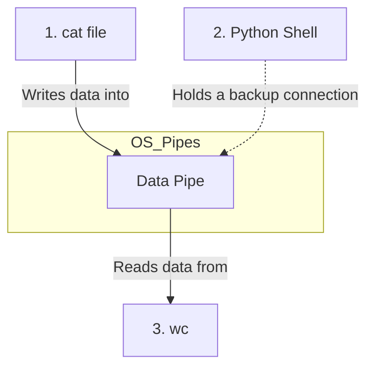
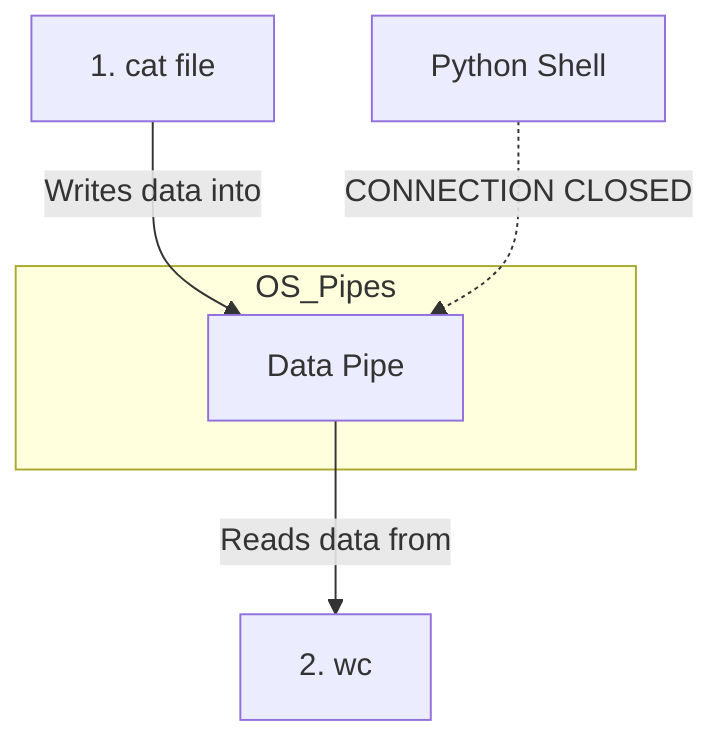
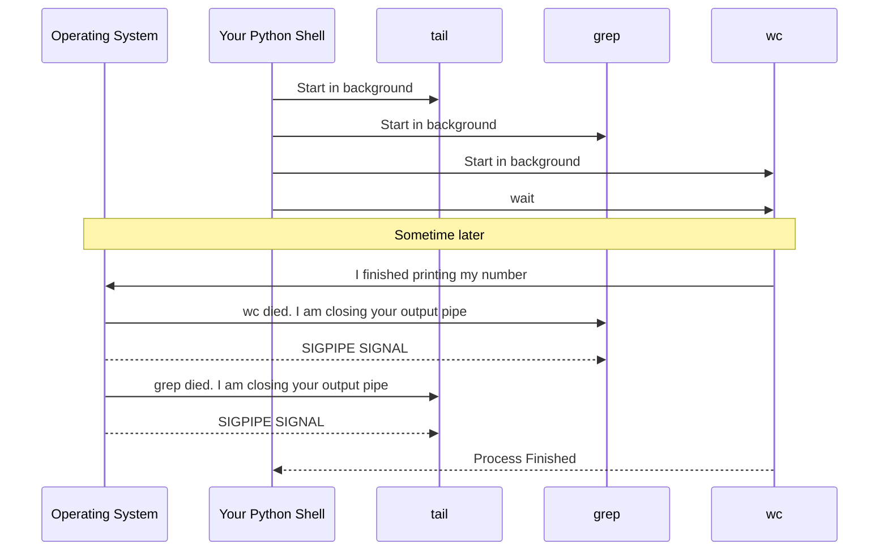

# Understanding Shell Pipelines in Python

Let's break down the logic of our pipeline code using a real example: `cat file.txt | grep hello | wc -l`. 

There are 3 core concepts at play here:

## 1. Starting everyone at the same time (No Waiting!)
In your first approach, you used `.communicate()`, which is like saying *"Start `cat`, wait until it is 100% finished, get its text, and then hand it to `grep`"*.

Our new code uses `subprocess.Popen()`. This tells the Operating System: *"Start this program in the background and immediately give me back control."* 
Because it doesn't wait, our `for` loop blazes through and starts `cat`, `grep`, and `wc` almost instantaneously. They are all running simultaneously!

---

## 2. Connecting the Plumbing (STDIN and STDOUT)

### Why `stdin_source = subprocess.PIPE`?
If they are all running at the same time, how does the data get from one to the other? We build a "pipe" (a data tunnel) between them using `subprocess.PIPE`.

For the very first external command in your pipeline, you might wonder why we don't just let it read from the normal keyboard. 

Remember this part of the code?
```python
if not processes and builtin_output is not None:
    process.stdin.write(builtin_output)
    process.stdin.close()
```
Because `echo` is a built-in command in your shell, we captured its output into a Python string variable (`builtin_output`). But the next command, `wc`, is an external command that doesn't know anything about Python variables! 

So, we tell Python: *"Create a pipe (`stdin_source = subprocess.PIPE`) for `wc`. I am going to manually shove my Python string into that pipe using `.write()` so `wc` can read it."*

---

## 3. The Closing Mechanism Visualized
When you create a Pipe between two processes, think of it like a physical water pipe. 

Here is what it looks like when `cat file.txt | wc` is running:



Notice how **both** `cat` and your `Python Shell` have the ability to write into that pipe! 
Because Python created the pipe using `subprocess`, Python keeps a "handle" (a connection) to it just in case you want to write to it later using Python code.

**What happens if we DON'T close Python's connection?**
1. `cat` finishes reading the file. It closes its connection to the pipe and dies.
2. `wc` is sitting there waiting for data. It looks at the pipe and says: *"Well, `cat` left, but that Python script is still connected to the pipe! I better keep waiting in case Python sends me something."*
3. `wc` hangs forever.

**What happens when we DO close it (`processes[-1].stdout.close()`)?**

1. We immediately close Python's backup connection to the pipe.
2. Now, `cat` is the *only* thing connected to the writing side.
3. When `cat` finishes and dies, the writing side of the pipe drops to **0 connections**.
4. The OS tells `wc`: *"Everyone left! There is no more data coming, ever."*
5. `wc` safely finishes its math, prints the final result, and exits!

---

## 4. The Grand Finale Visualized
Because we did the closing mechanism correctly, a beautiful chain reaction happens at the very end when we say `processes[-1].wait()`.

Let's look at `tail -f | grep error | wc -l`:



Because we connected them with OS pipes, we don't have to manage them or kill them ourselves. As soon as the last command (`wc`) decides it is done, the Operating System rips the pipes out from under the rest of the commands and kills them automatically. 

That is why we only ever have to `.wait()` on the very last process!
